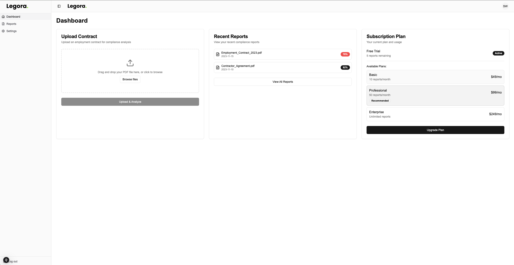
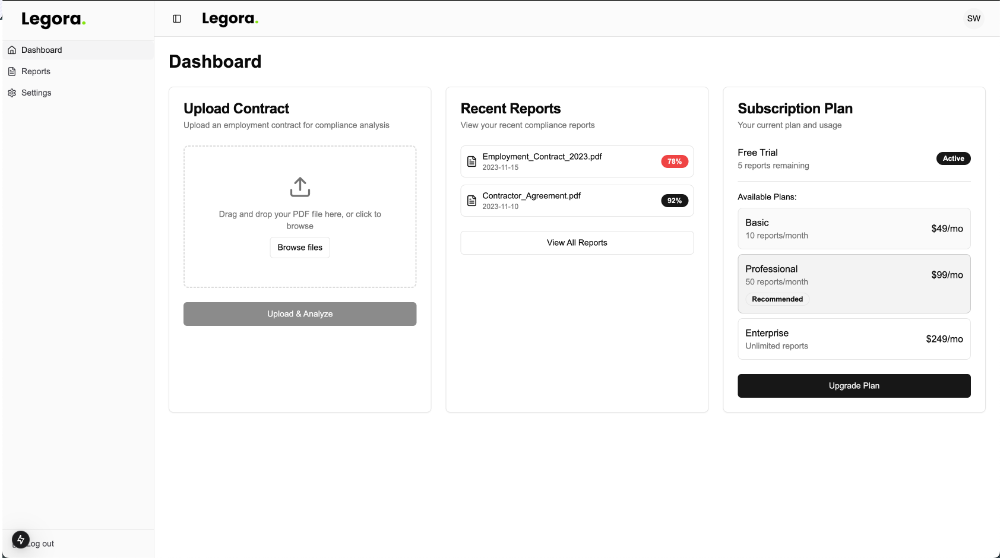
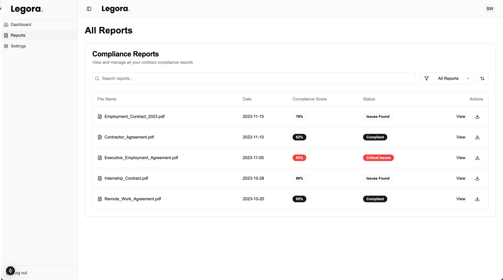
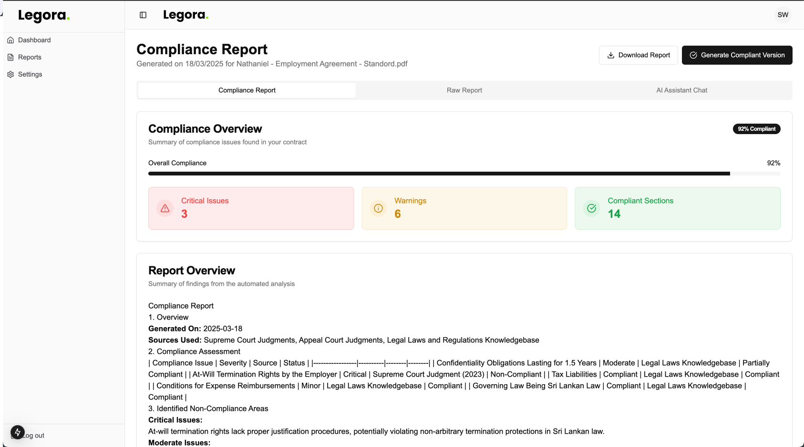
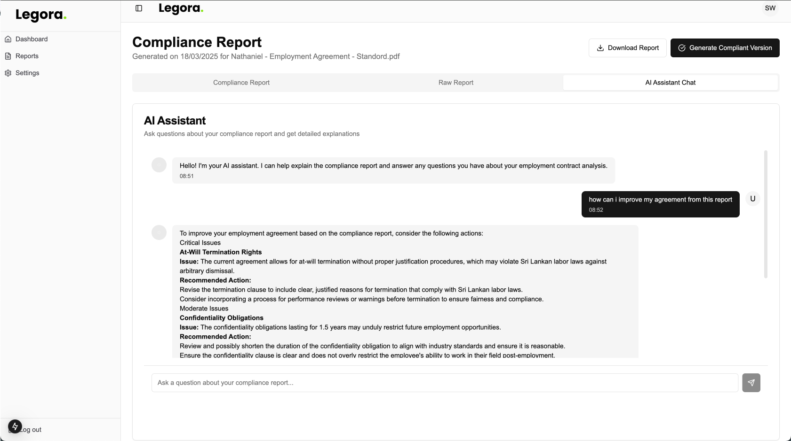
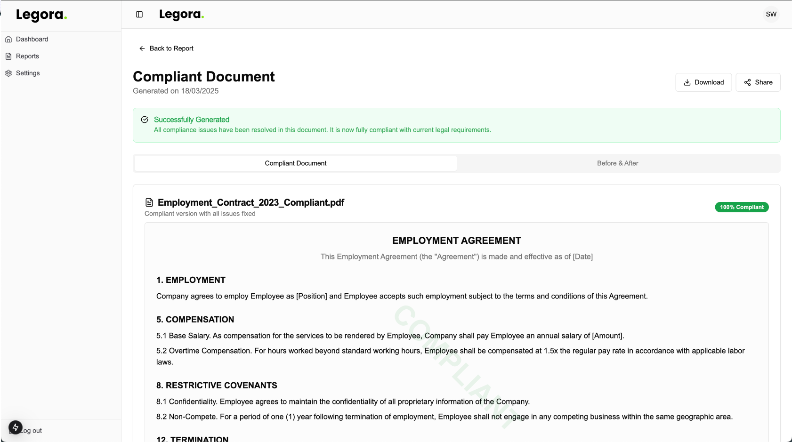

# Legora - Frontend

This is the **frontend** of the Legal Document Analysis system, built using **Next.js**. It provides an intuitive UI for users to submit legal documents for analysis, track job statuses, and view reports.

## Screenshots
Below are some screenshots of the application in action:








## Features
- **User-friendly UI** for document submission and tracking
- **Real-time job status updates**
- **MngoDB to track everything**
- **Chat with the docs** to know the thinking process of the agents
- Provide you with a **complient document** at the end
- **Seamless integration** with the backend FastAPI service
- **Responsive design** for optimal viewing across devices

## Technologies Used
- **Next.js** - React framework for server-side rendering and static site generation
- **Tailwind CSS** - Styling framework for a modern UI
- **Axios** - HTTP client for API communication
- **React Query** - Data fetching and state management
- **Vercel** - hosting

## Installation & Setup

1. **Clone the repository:**
   ```sh
   git clone https://github.com/your-repo/legal-document-analysis-frontend.git
   cd legal-document-analysis-frontend
   ```
2. **Install dependencies:**
   ```sh
   npm install
   # or
   yarn install
   ```
3. **Set up environment variables:**
   Create a `.env.local` file and add the following:
   ```ini
   NEXT_PUBLIC_API_BASE_URL=http://localhost:8000
   ```
4. **Run the development server:**
   ```sh
   npm run dev
   # or
   yarn dev
   ```
   The application will be available at `http://localhost:3000`

## Usage
1. **Upload a document** After logging in, using the file submission section in the dashbaord.
2. **Track job progress** in the dashboard.
3. **View the analysis results** once processing is complete.

